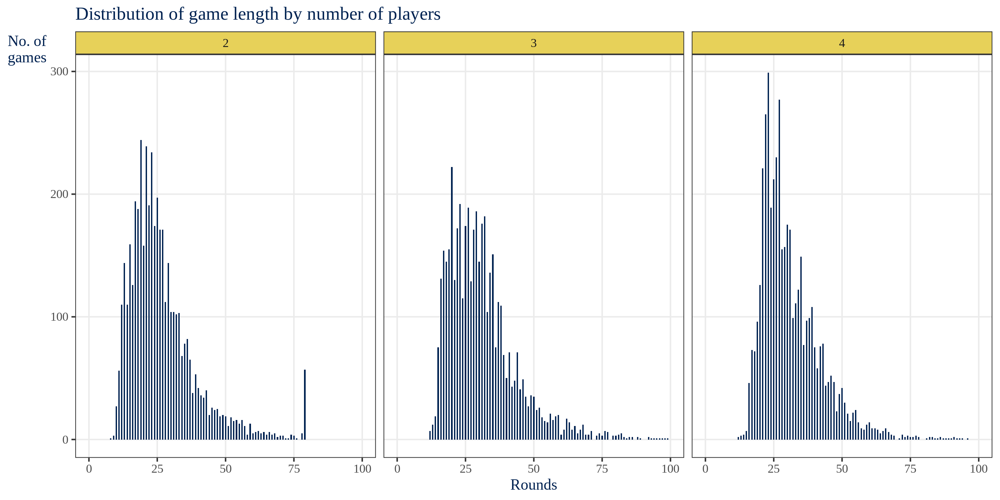

# Kids monoply simulation
Simulation of the kid's version of monopoly with simplified rules. This is used to run simulations over several games with minor tweaks to see the outcomes of changing initial balance etc. This version of monopoly is much easier to create NPCs for since it doesn't really involve any decisions. If you end up on an empty lot you have to buy it. 
The only decisions are from chance cards where you get to choose what lot to buy, but the general decision is to go to the first free of the most expensive one available.
The implementations are intended to be run by 2-4 NPCs rather than human players.

## Versions

### R - or monoplyR perhaps...

The R version is completely table (or tibble) driven and functional, in general without side effects etc. It is however sometimes overly complicated (and apparently not recommended) to create a game simulation with a data manipulation language...

### Python

The python version will be object oriented and methods may well have side effects. 

### C++

If there is ever a C++ version built it will be built around pointers to the player and board structs, something that will likely simplify some quirky parts of the R-implementation.

## Quick Analysis

The simulation was run for a maximum of 40 rounds per player, using 2, 3 and 4 players. For each number of players, 4500 games were played.

### Rounds played before defeat

Obviously the number of rounds increase with the number of players but not by all that much, the game is generally over within 40 rolls if the die.

### Winners and loosers

In general, the first player to roll the die has the greatest chance of winning and the last player runs the biggest risk of loosing. This is likely explained by the first player simply being the most likely to first buy each lot, thus gaining rent from more lots. Consequently, the other players run a greater risk of ending up with not enough money to pay that rent, hence loosing the game.

The above hypothesis is further supported by the fact that player 0 generally has more lots than the other players. 

This does however go both ways, and player 0 also owns more lots when it is loosing than other players do. In general a player layer has fewer lots when loosing than when winning.

In terms of which lots are most commonly owned by the respective players,  the middle groups are more often owned by the winner. This has likely got to do with them being affordable, i.e. not resulting in a loss by having to purchase, while at the same time resulting in somewhat higher rents than the first two groups. The last group with the most expensive lots are rarely owned by either the winner or the looser, which goes a bit against the common notion that the most expensive lots are the best to own. 

